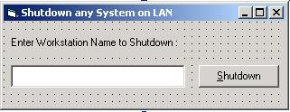

<div align="center">

## VB code with Window Network API


</div>

### Description

With this code your can Shutdown any Workstation connected on LAN (Local Area Network) od Windows NT/2000.

This code is very usefull for LAN applications. It will give an good idea to communicate with other worstations.
 
### More Info
 
Just Workstation Name to Shutdown

User must know something about Windows API and some knowledge of Network.

Required Workstation will Shutdown

There no side effects for this code.


<span>             |<span>
---                |---
**Submitted On**   |
**By**             |[Abid Khurshid Butt](https://github.com/Planet-Source-Code/PSCIndex/blob/master/ByAuthor/abid-khurshid-butt.md)
**Level**          |Advanced
**User Rating**    |3.9 (35 globes from 9 users)
**Compatibility**  |VB 6\.0
**Category**       |[Windows API Call/ Explanation](https://github.com/Planet-Source-Code/PSCIndex/blob/master/ByCategory/windows-api-call-explanation__1-39.md)
**World**          |[Visual Basic](https://github.com/Planet-Source-Code/PSCIndex/blob/master/ByWorld/visual-basic.md)
**Archive File**   |[](https://github.com/Planet-Source-Code/abid-khurshid-butt-vb-code-with-window-network-api__1-27045/archive/master.zip)

### API Declarations

```
Private Declare Function InitiateSystemShutdown Lib "advapi32.dll" Alias "InitiateSystemShutdownA" (ByVal lpMachineName As String, ByVal lpMessage As String, ByVal dwTimeout As Long, ByVal bForceAppsClosed As Long, ByVal bRebootAfterShutdown As Long) As Long
```


### Source Code

```
Private Sub Command1_Click()
  Dim a
  a = InitiateSystemShutdown(Trim(Text1.Text), "Hello", 0, 0, 1)
  MsgBox "Shutdown Completed"
End Sub
```

